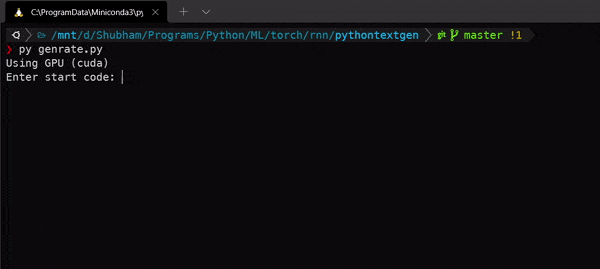

# Python Code Genrator
Genration python code using LSTM 

run `genrate.py`

Save Traing Data in `./data/input.txt`
 
Change hyper params in `main.py`.
reduce chunk_len or num_layer if you
want to train faster

run `main.py` for training